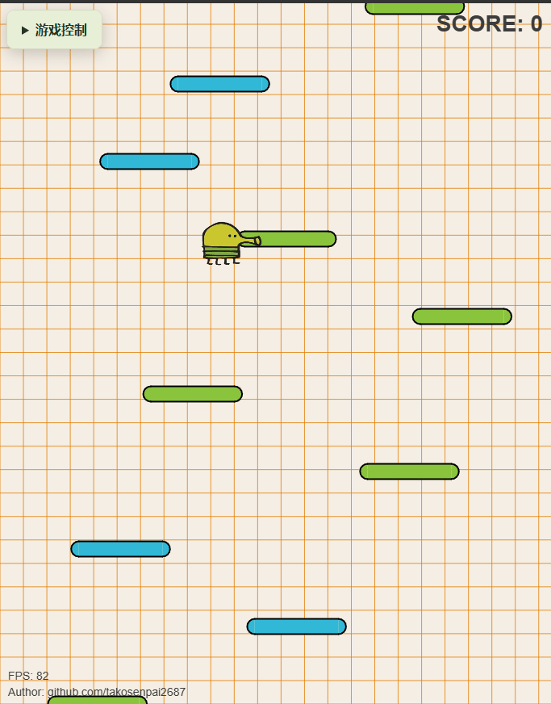

# Doodle Jump 强化学习课程项目

保留原版 JavaScript 游戏的外观、物理与平台生成规则，在实际窗口训练并比较 **DQN、Double DQN、PPO**。包含可试玩网页、训练与评测代码、训练权重、实验数据、13分钟PPT及四份个人报告和小组报告。

## 最新汇报与正式报告

- **[18页PPT美化完善版](DoodleJump_13分钟汇报_美化完善版.pptx)**：14页主讲共13分钟，4页答辩附录，四位讲者各3分15秒。
- [直接浏览全部幻灯片](slides/README.md) / [新版逐页讲稿](13分钟讲稿.md)
- **[正式PDF报告与可编辑源稿](reports/README.md)**：四份个人模块报告及小组技术报告。
- [下载完整项目](https://github.com/25zs25/DoodleJump-RL-CourseProject/releases/latest) / [项目问题检查与修复记录](PUBLICATION_AUDIT_20261008.md)

报告技术正文已补全。姓名、学号和实际参与范围由组员据实填写，建议分工不代替真实贡献。初版PPT和旧720窗口实验保留供历史追溯，汇报请使用上面的新版入口。



## 组员快速开始

```bash
git clone https://github.com/25zs25/DoodleJump-RL-CourseProject.git
cd DoodleJump-RL-CourseProject
python serve.py --port 8765
```

浏览器打开 http://127.0.0.1:8765/ ，选择手动、DQN、Double DQN或PPO并点击开始。Windows也可直接双击 `start_game.cmd`。试玩只需Python 3，无需安装PyTorch；训练才需要 `requirements.txt` 中的依赖。端口被占用时可改为 `--port 8766`。GitHub仓库页面本身不运行游戏。

## 当前实验结果

| 算法 | 参数量 | 平均原版得分 ± 标准差 |
| --- | ---: | ---: |
| DQN | 43,779 | 18,476.5 ± 1,145.6 |
| Double DQN | 43,779 | 18,584.2 ± 1,969.7 |
| PPO（含价值头） | 43,908 | 3,944.8 ± 535.6 |

同一683×871训练与测试窗口；每算法3个训练种子，每种子100万决策和100张测试地图。±为3个训练种子均分的样本标准差。AI最多1500决策，DQN/DDQN约19.7%的测试局达到时限；这些有限预算成绩不能证明算法的普遍优劣。另有PPO消融和跨窗口评测，总计12次训练、1200万决策与5400局评测。

## 交付与协作入口

- [13分钟PPT](DoodleJump_13分钟汇报_美化完善版.pptx) / [逐页讲稿](13分钟讲稿.md)
- [小组技术报告](reports/小组技术报告.md) / [四人分工](reports/四人分工与验收.md)
- [实验结果](results/native_v2/summary.json) / [旧模型与重训对比](results/native_v2/旧模型与重训对比.md)
- [组员协作说明](CONTRIBUTING.md) / [发布说明](PUBLICATION_NOTES.md)
- [完整项目下载](https://github.com/25zs25/DoodleJump-RL-CourseProject/releases/latest)

四份个人报告以A–D划分模块，包含正式PDF和可编辑Markdown。组员应填写真实姓名并按实际贡献修改。下面的原交付说明提供完整训练、复现和验证方法；旧720窗口文件仅作为历史实验，不代表当前成绩。

## 开源许可与来源

本项目新增代码使用[MIT许可证](LICENSE)。原版来自 [takosenpai2687/doodle-jump](https://github.com/takosenpai2687/doodle-jump/tree/d4b6071813a9c1353267d53dcfa9d8abc3e5b2f4)，原代码MIT许可与署名保留在 `upstream/LICENSE`、`upstream/README.md`。第三方库、图像和音效的来源及许可说明见 [THIRD_PARTY_NOTICES.md](THIRD_PARTY_NOTICES.md)；项目的MIT声明不替代第三方素材的权利。

---

# 原交付详细说明

本次交付使用 `takosenpai2687/doodle-jump` 固定提交 `d4b6071813a9c1353267d53dcfa9d8abc3e5b2f4`。`upstream/` 的21个原文件全部保持原样，浏览器执行原版游戏；训练接口只增加可控随机源、观测、动作、奖励记录和AI时限。平台概率、随机位置、物理、碰撞及原版得分未修改。

## 试玩

双击 `start_game.cmd`，或在本目录运行：

```powershell
python serve.py --port 8765
```

打开 http://127.0.0.1:8765/ 。已有页面请Ctrl+F5刷新。选择手动、随机或DQN/Double DQN/PPO，点击开始；←/→或A/D移动，空格暂停。手机点击原游戏左右半边。控制面板可以收起。模型种子不作为试玩选项，地图种子用于复现。手动游戏没有1500决策上限，AI每次4物理帧决策，最多1500次决策。

新网络均在用户当前实测 **683×871** 画布从头训练。试玩继续使用浏览器实际尺寸；改变窗口后刷新初始化，表现可能随原版窗口规则改变。直接原版入口为 `upstream/index.html`，独立同种子逐帧对照为 `compare.html`。

## 已完成实验

网络保持209→128→128→3。DQN/Double DQN各43,779参数，PPO连同价值头43,908参数（部署策略43,779）。主实验三算法×三训练种子42/59/143，各100万决策；另有三次PPO速度信息置零消融，总计12次、1200万决策。模型按10000–10019验证地图的平均原版得分选择，不使用测试选模型。

测试数据：当前683×871画布61000–61099；桌面596.25×1060画布62000–62099；手机390×844画布63000–63099。39组新策略评测3900局，随机/规则参考600局；九个旧完整观测模型在当前窗口复测900局，共5400局。每种条件仍执行原版平台生成公式。相同种子给出相同随机流，但不同动作可改变触发滚屏和未来平台生成的时刻，所以不意味着各策略始终经历逐帧相同的后续地图。

成绩见 `reports/小组技术报告.md`、`results/native_v2/summary.json` 和 `results/native_v2/test_episodes.csv`。±为三个训练种子均分之间的样本SD。原版得分与最高上升高度分开记录，不称作通关率。

## 训练和复现

本次设备为i7-12700H、16GB内存，RTX3060 Laptop 6GB可用。小网络20,000步计时CPU1931步/秒、CUDA1343步/秒，因此正式实验采用CPU，三个训练进程并行、每进程一个Torch线程。各次时间包含验证和并行竞争，不能当作通用CPU/GPU速度结论。版本见 `requirements-tested.txt`。

```powershell
python -m pip install -r requirements.txt
python retrain_native.py --train --workers 3
python retrain_native.py --evaluate --workers 2
python analyze_native.py
```

上述命令复用已完成运行；完全重新复现请复制项目，在副本中保留协议、删除副本中的新模型目录及 `results/native_v2/`，再运行。训练入口拒绝覆盖不完整目录。

单独重训一个原规模Double DQN（新run-id）：

```powershell
python train.py --algorithm double_dqn --hidden 128 --device cpu --seed 42 --steps 1000000 --epsilon-decay-steps 600000 --checkpoint-every 50000 --viewport-json experiments/native_retrain_20261008/viewport.json --run-id my_native_ddqn_seed42
python evaluate.py --checkpoint models/my_native_ddqn_seed42/best.pt --seed-start 70000 --episodes 100 --output results/my_native_ddqn_test.json
```

测试已冻结模型：

```powershell
python evaluate.py --checkpoint models/native_v2_double_dqn_full_h128_seed42_1000000/best.pt --seed-start 70000 --episodes 100 --output results/additional_test.json
```

新检查点自带窗口元数据，默认按683×871评测。若希望研究自己的实际窗口，刷新游戏后导出训练窗口，并用新的实验协议和run-id；不要把它的结果混进本次统计。

## 学习内容和材料

输入209维：玩家5、最多20个平台各10、单黑洞4；输出左/停/右。奖励 `Δ原版得分/100 − 0.001 − 1×死亡`。DQN使用回放和目标网络，Double DQN分离下一动作选择与价值估计；PPO使用Actor/Critic、GAE和概率比裁剪。死亡屏蔽bootstrap，时间截断保留价值但阻断跨回合GAE递推。

最新PPT：`DoodleJump_13分钟汇报_美化完善版.pptx`，14页主讲共780秒，4页答辩附录；配套 `13分钟讲稿.md`，四位讲者各195秒。四份个人模块报告与小组报告以PDF和Markdown形式放在 `reports/`。成员姓名和实际个人贡献由四位成员填写，技术稿不虚构人工作业经历。演示及失败案例仅从验证集选取，见 `DEMO.md`，真实浏览器录像为 `assets/native_demo.gif`。

## 验证与历史文件

```powershell
python -m unittest discover -s tests -p test_agents.py
python tests/verify_original.py
python tests/verify_native_window.py
```

原JS数值对照81803帧和7项特殊案例、4种实际浏览器窗口的13191帧对照、当前683×871窗口4202帧对照及800帧Python核对都通过。12个新模型×360个输入的网页推理与PyTorch对齐，结果见 `tests/native_v2_browser_inference.json`。浏览器QA需Node.js、Playwright与本机Edge，Python训练无需浏览器。

旧405×720实验文件保留用于追溯，`experiments/legacy_720_delivery/` 与旧PPT不代表当前成绩。此前512容量尝试已取消，本次未扩大网络。部分窗口会触发上游原版自身的间距或重复缩放行为，证据见 `WINDOW_AUDIT.md`；不擅自修改地图或物理修复它们。
