# 13分钟汇报：全部幻灯片预览

[可编辑PPT](../DoodleJump_13分钟汇报_美化完善版.pptx) · [逐页讲稿](../13分钟讲稿.md) · [正式报告](../reports/README.md) · [完整项目下载](https://github.com/25zs25/DoodleJump-RL-CourseProject/releases/latest)

14页主讲共780秒，包含第13页的25秒真实推理演示；4页附录用于答辩。A讲1–4页、B讲5–8页、C讲9–11页、D讲12–14页，每人195秒（3分15秒）。姓名和个人实际贡献按真实情况补全。

以下为最终PPT逐页渲染的图片预览。PPT里的文字、表格和6个原生图表可继续编辑，图片预览用于在线查看。

| 页码 | 内容 | 讲者 | 建议时长 |
| --- | --- | --- | --- |
| 1 | Doodle Jump 原版规则强化学习 | A | 25秒 |
| 2 | 原版游戏与左右控制 | A | 55秒 |
| 3 | 原版引擎与训练接口 | A | 55秒 |
| 4 | 209维局部观测与奖励 | A | 60秒 |
| 5 | DQN的回放与价值更新 | B | 55秒 |
| 6 | Double DQN的动作选择与估值 | B | 50秒 |
| 7 | 独立训练、验证与保留测试 | B | 50秒 |
| 8 | 三种子的验证学习曲线 | B | 40秒 |
| 9 | PPO的策略、价值与优势更新 | C | 65秒 |
| 10 | 当前窗口的保留地图结果 | C | 65秒 |
| 11 | PPO速度置零消融 | C | 65秒 |
| 12 | 原版窗口缩放下的测试 | D | 65秒 |
| 13 | 真实推理与失败回合 | D | 65秒 |
| 14 | 本次结论与四人分工 | D | 65秒 |
| 15 | 附录：超参数与实际训练设备 | 答辩 | 答辩备用 |
| 16 | 附录：旧模型在同一当前窗口复测 | 答辩 | 答辩备用 |
| 17 | 附录：输入向量的精确字段 | 答辩 | 答辩备用 |
| 18 | 附录：原版、部署证据与共享入口 | 答辩 | 答辩备用 |

## 第1页 · Doodle Jump 原版规则强化学习

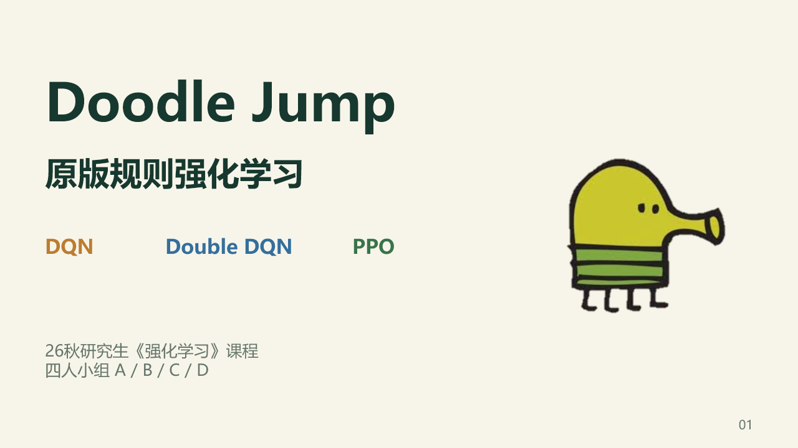

## 第2页 · 原版游戏与左右控制

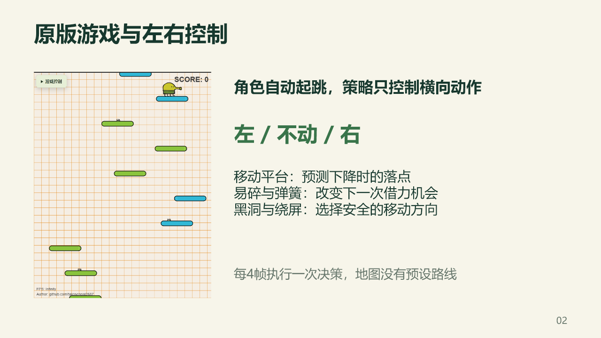

## 第3页 · 原版引擎与训练接口

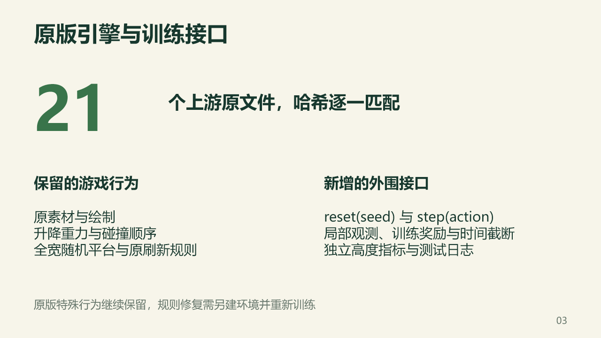

## 第4页 · 209维局部观测与奖励

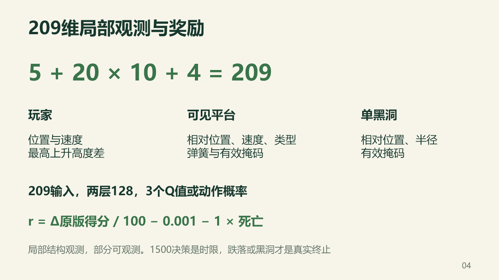

## 第5页 · DQN的回放与价值更新

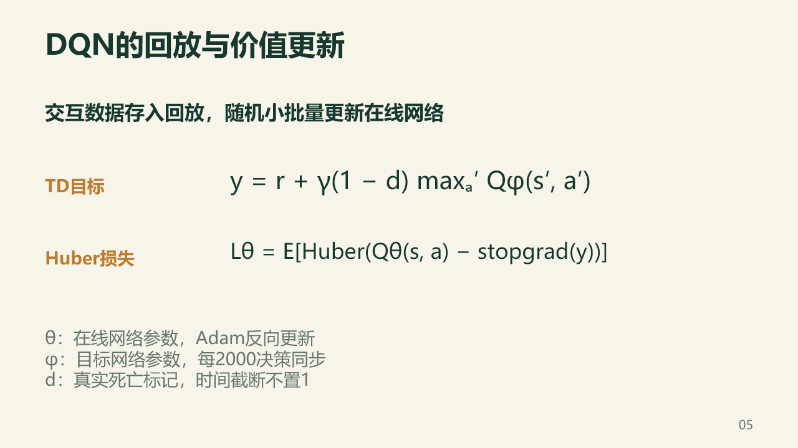

## 第6页 · Double DQN的动作选择与估值

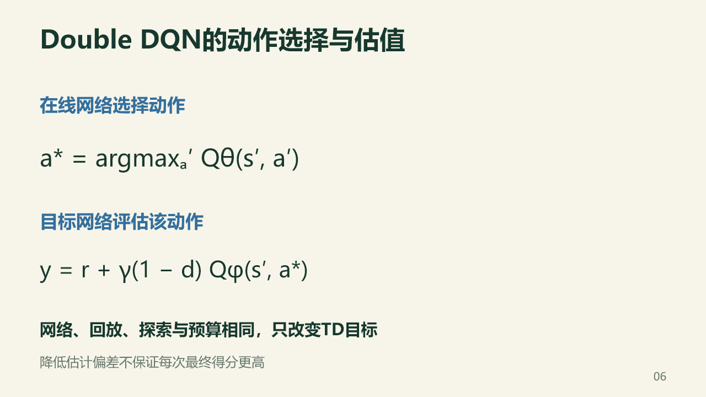

## 第7页 · 独立训练、验证与保留测试

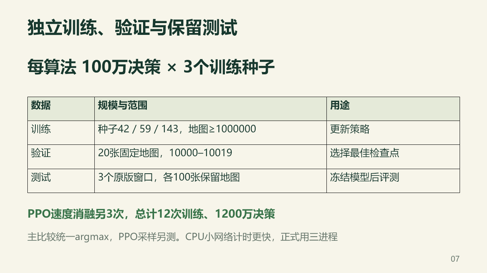

## 第8页 · 三种子的验证学习曲线

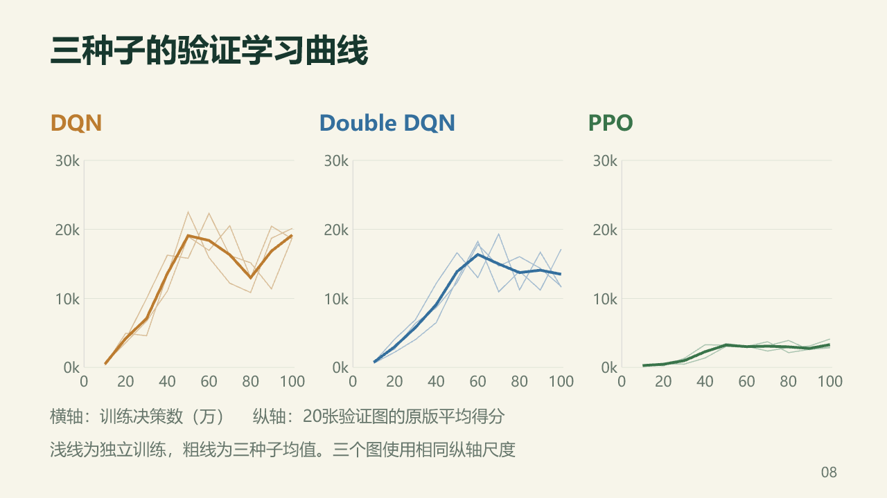

## 第9页 · PPO的策略、价值与优势更新

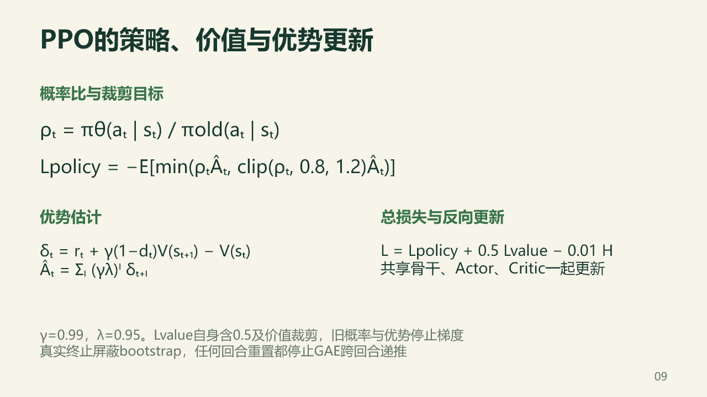

## 第10页 · 当前窗口的保留地图结果

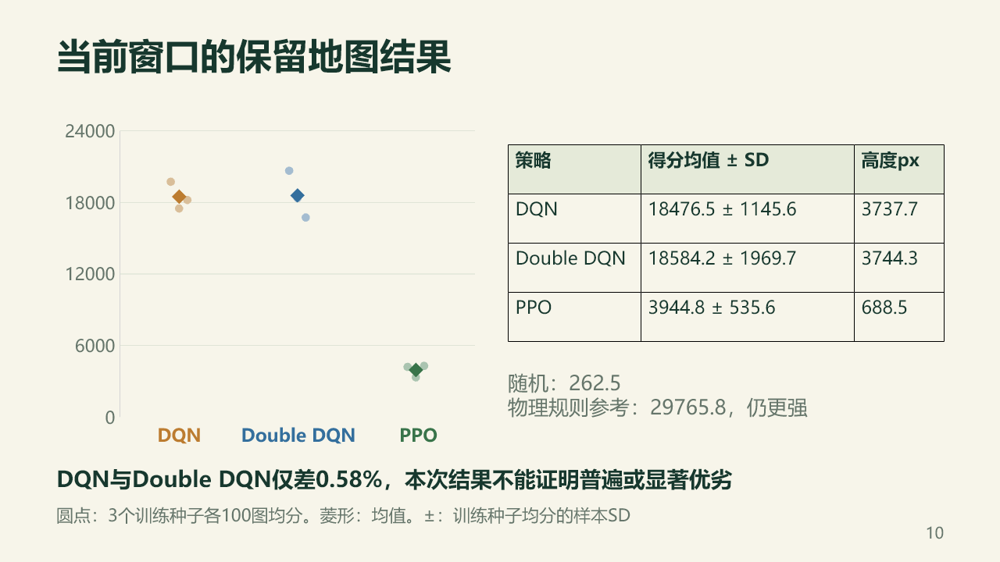

## 第11页 · PPO速度置零消融

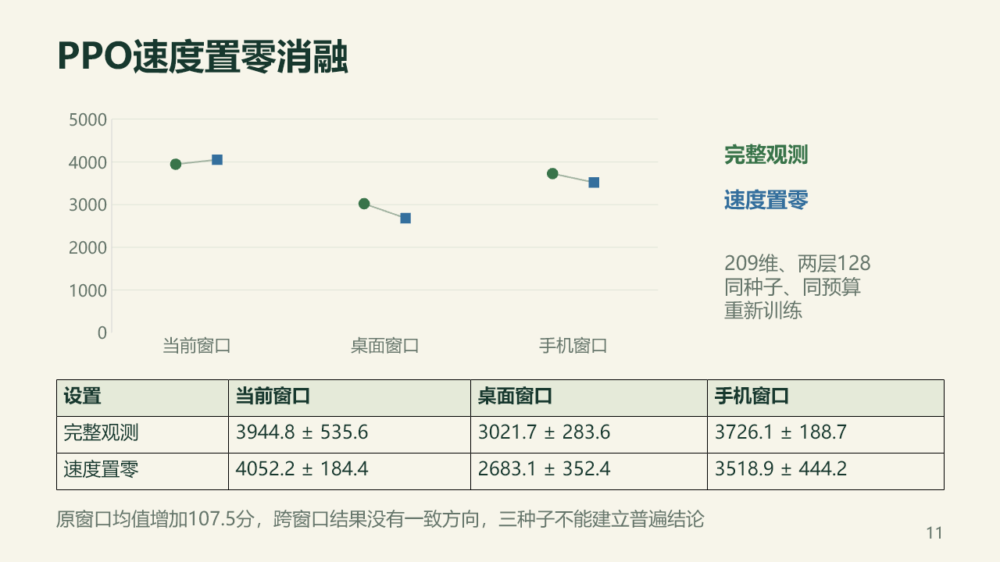

## 第12页 · 原版窗口缩放下的测试

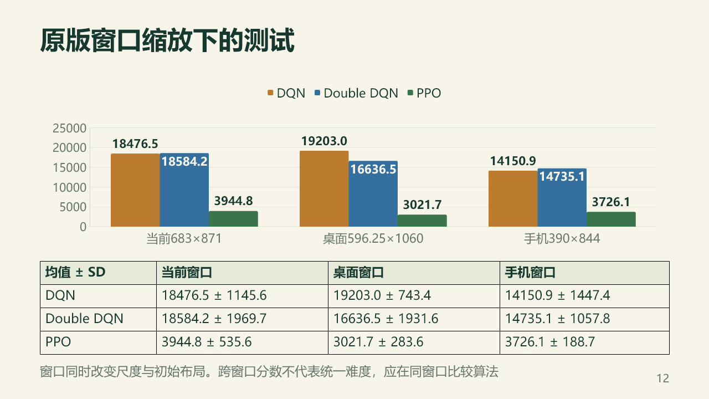

## 第13页 · 真实推理与失败回合

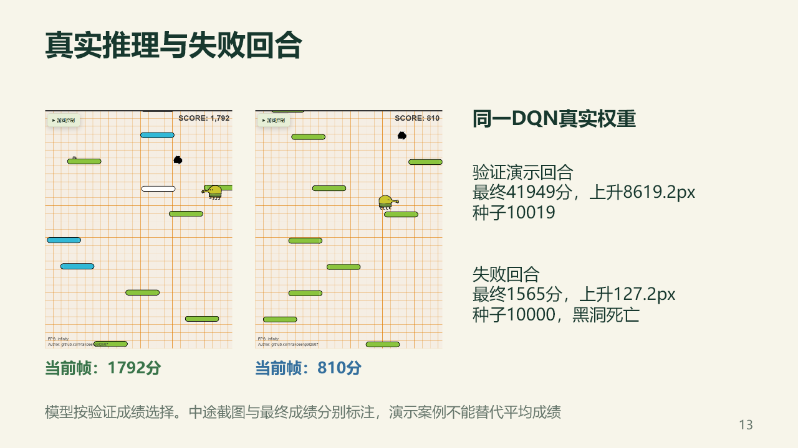

## 第14页 · 本次结论与四人分工

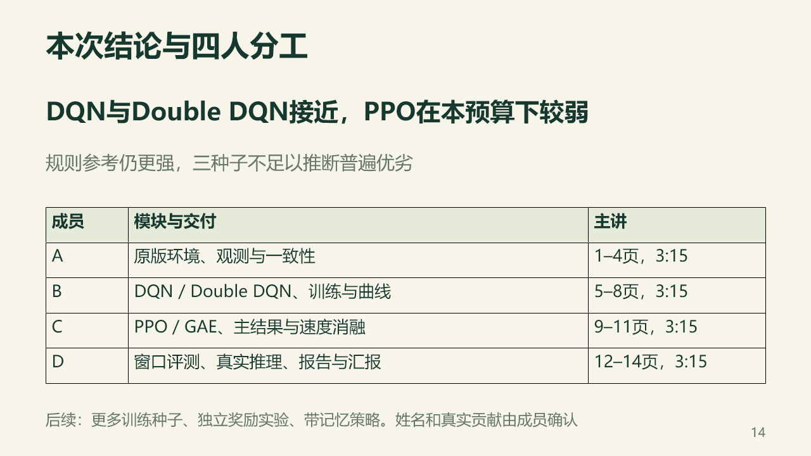

## 第15页 · 附录：超参数与实际训练设备

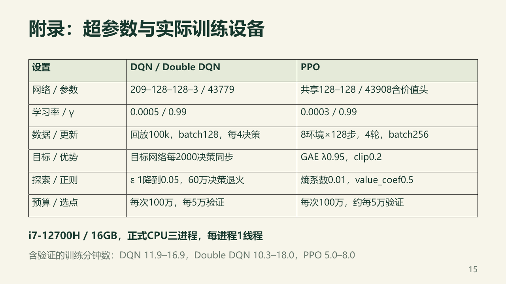

## 第16页 · 附录：旧模型在同一当前窗口复测

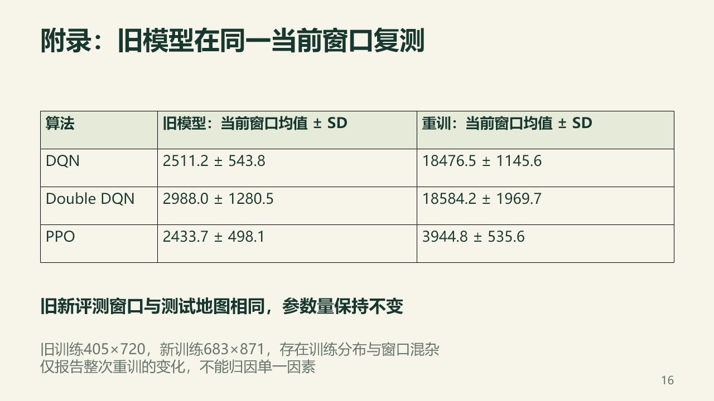

## 第17页 · 附录：输入向量的精确字段

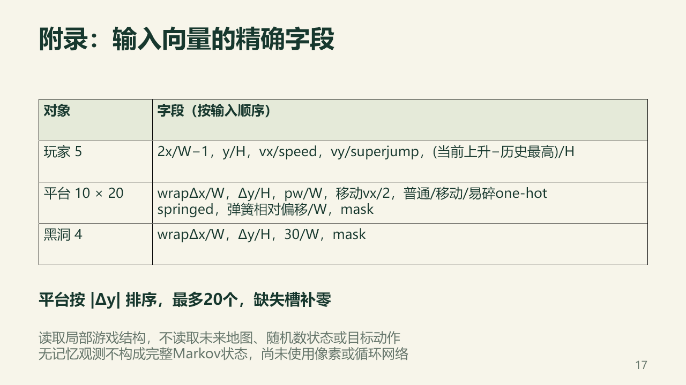

## 第18页 · 附录：原版、部署证据与共享入口

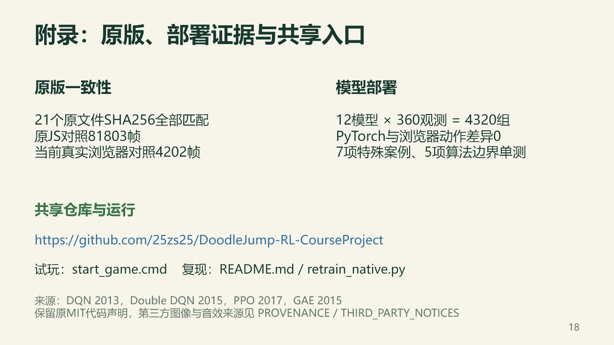
